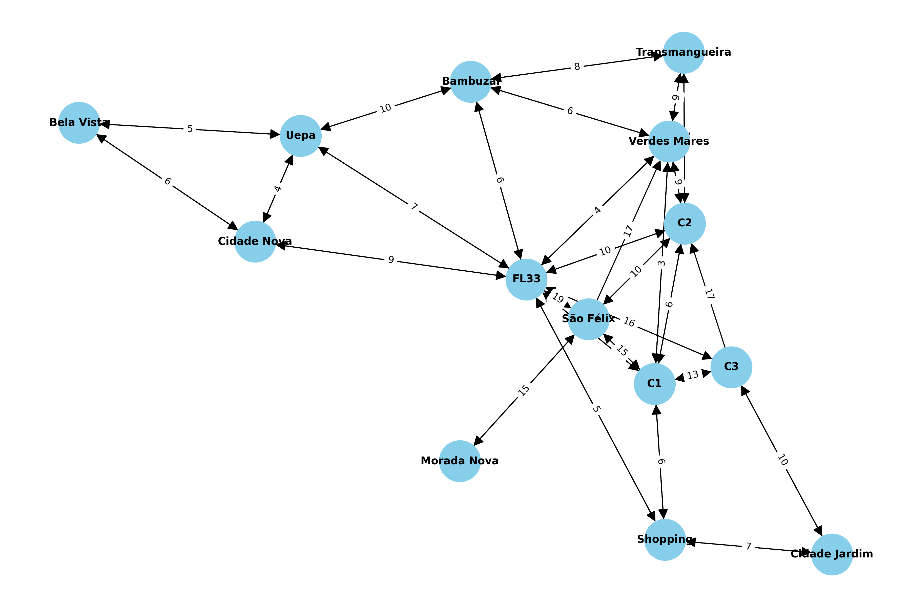

# Índice
- [Objetivos](#objetivos)
- [Metodologia e desenvolvimento](#metodologia-e-desenvolvimento)
- [Comparação dos Algoritmos](#comparação-dos-algoritmos)
- [Conclusão](#conclusão)

# Objetivos 
O objetivo do projeto foi adotar novas tecnologias para melhorar a eficiência do sistema de transporte público de Marabá (PA). Um dos desafios principais foi otimizar as rotas dos ônibus para garantir que os cidadãos possam se deslocar de maneira eficiente entre diferentes pontos da cidade, aproveitando o máximo de suas rotas, minimizando o tempo de deslocamento e o custo operacional. Entre os objetivos específicos destacam-se:

### 📌 Encontrar as rotas mais eficientes
Utilizar o Algoritmo de Dijkstra e o Algoritmo de Bellman-Ford para determinar as rotas mais curtas entre os principais núcleos da cidade (Cidade Jardim, Nova Marabá, Cidade Nova, Marabá Pioneira, São Félix e Morada Nova).

### 📌 Analisar a importância dos pontos de interesse
Aplicar o Algoritmo de PageRank para ponderar os pontos de interesse dentro da rede de transporte, ou seja, definir os pontos mais importantes/mais críticos na rede, pelos quais a maior parte das rotas passam.

### 📌 Simulação e otimização
Considerar um cenário onde uma rota importante é temporariamente interrompida e utilizar os algoritmos mencionados para redirecionar as rotas e minimizar o impacto sobre os usuários do transporte.

# Metodologia e desenvolvimento 
Para atingir o resultado desejado foi modelado o sistema de transporte público como um grafo, onde os pontos de ônibus são representados como vértices e as rotas possíveis entre eles como arestas, com pesos que refletem o tempo de viagem ou a distância.

### Modelagem do grafo
O grafo apresentado foi construído com base no mapa urbano da região de Marabá-PA, considerando pontos estratégicos que representam bairros e polos educacionais importantes. Nele, destacam-se localidades como Morada Nova, São Félix, os três campi da Unifesspa (C1, C2 e C3), as folhas 26 e 33 da Nova Marabá, além de áreas centrais como a Transmangueira, Bambuzal, UEPA e a Avenida Bela Vista. As conexões entre os nós simbolizam rotas de deslocamento entre esses pontos, com pesos representando distâncias ou tempos estimados de trajeto, o que permite a aplicação de algoritmos de otimização para melhorar o transporte público local.



### ♦️ Algoritmo ([Dijkstra](Dijkstra/main.py))
O algoritmo de Dijkstra é utilizado para determinar o trajeto mais curto em grafos cujas arestas possuem pesos positivos ou nulos. Por isso, ele é bastante eficiente em aplicações como sistemas de transporte, onde tempo e distância não podem ser negativos. Além disso, ele se destaca pelo bom desempenho ao lidar com grafos de grande porte e com muitas conexões.

**1. Importando as bibliotecas**
```python
import heapq
import networkx as nx
from copy import deepcopy
import matplotlib.pyplot as plt
```
- **heapq**: biblioteca padrão usada no algoritmo de Dijkstra para escolher o ponto com menor custo, através de uma fila de prioridade (heap mínimo).
- **networkx**: usada para criar e analisar grafos direcionados, calcular o PageRank e estruturar os dados da visualização.
- **copy.deepcopy**: faz cópias completas do grafo para simular bloqueios ou modificações sem alterar o original.
- **matplotlib.pyplot**: responsável por plotar o grafo na tela, exibindo os pontos, conexões e os pesos das arestas de forma visual.

**2. Convertendo tempo informado**
```python
def tempo_formatado(mins):
    h = mins // 60
    m = mins % 60
    return f"{h} horas e {m} minutos" if h else f"{m} minutos"
```
Essa função converte um tempo dado em minutos para uma string legível, mostrando horas e minutos ou somente minutos.

**3. Definindo o grafo**
```python
mapa = {
    'Bela Vista': {'Uepa': 5, 'Cidade Nova': 6},
    'Uepa': {'FL33': 7, 'Bambuzal': 5, 'Bela Vista': 5, 'Cidade Nova': 4},
    'FL33': {'Uepa': 7, 'C1': 6, 'C2': 10, 'C3': 16, 'Bambuzal': 6, 'Verdes Mares': 4, 'São Félix': 19, 'Cidade Nova': 9, 'Shopping': 5},
    'C1': {'C3': 13, 'C2': 6, 'São Félix': 15, 'Verdes Mares': 3, 'FL33': 6, 'Shopping': 6},
    'C2': {'FL33': 10, 'C1': 6, 'São Félix': 10, 'Verdes Mares': 7, 'Transmangueira': 10},
    'Bambuzal': {'FL33': 6, 'Uepa': 10, 'Verdes Mares': 4, 'Transmangueira': 4},
    'Transmangueira': {'Verdes Mares': 9, 'C2': 11, 'Bambuzal': 8},
    'Verdes Mares': {'FL33': 4, 'C2': 9, 'Transmangueira': 9, 'Bambuzal': 6, 'C1': 3},
    'C3': {'C2': 17, 'C1': 13, 'FL33': 16, 'Cidade Jardim': 10},
    'São Félix': {'C1': 15, 'C2': 10, 'Verdes Mares': 17, 'FL33': 19, 'Morada Nova': 15},
    'Morada Nova': {'São Félix': 15},
    'Cidade Jardim': {'C3': 10, 'Shopping': 7},
    'Shopping': {'Cidade Jardim': 7, 'C1': 6, 'FL33': 5},
    'Cidade Nova': {'Bela Vista': 6, 'Uepa': 4, 'FL33': 9}
}
```
Aqui é definido o grafo que representa a rede de pontos e conexões do sistema. Cada chave é um ponto de parada e seu valor é um dicionário com pontos vizinhos e o peso da conexão (que representa tempo). Este grafo serve de base para o cálculo de rotas.

**4. Implementando o algoritmo**
```python
ddef dijkstra(grafo, inicio, fim):
    heap = [(0, inicio, [])]
    visitados = set()

    while heap:
        (custo, atual, caminho) = heapq.heappop(heap)
        if atual in visitados:
            continue
        visitados.add(atual)
        caminho = caminho + [atual]
        if atual == fim:
            return custo, caminho
        for vizinho, peso in grafo.get(atual, {}).items():
            if vizinho not in visitados:
                heapq.heappush(heap, (custo + peso, vizinho, caminho))
    return float('inf'), []
```
Esta função implementa o algoritmo de Dijkstra, que busca o caminho mais curto entre dois pontos no grafo. Ela usa uma fila de prioridade para explorar os caminhos de menor custo primeiro, acumulando os pesos das conexões. Retorna o custo total e o percurso encontrado.

**5. Criando rota 'Transmangueira' -> 'C2'**
```python
def rota_total(grafo):
    pontos = list(grafo.keys())
    if not pontos:
        return 0, []

    trajeto = [pontos[0]]
    tempo_total = 0
    pontos_visitados = set(trajeto)
    ponto_atual = pontos[0]

    while len(pontos_visitados) < len(pontos):
        menor_custo = float('inf')
        proximo_ponto = None
        melhor_caminho = []

        for ponto in pontos:
            if ponto in pontos_visitados:
                continue
            custo, caminho = dijkstra(grafo, ponto_atual, ponto)
            if custo < menor_custo:
                menor_custo = custo
                proximo_ponto = ponto
                melhor_caminho = caminho
        
        if proximo_ponto is None: # Não há mais pontos alcançáveis
            break
        
        trajeto.extend(melhor_caminho[1:])
        tempo_total += menor_custo
        ponto_atual = proximo_ponto
        pontos_visitados.add(ponto_atual)
        
    return tempo_total, trajeto
```
Esta função monta uma rota que começa em 'Morada Nova' e termina em 'C3', passando por todos os outros pontos do grafo. Para isso, a cada passo, escolhe o próximo ponto mais próximo ainda não visitado, usando Dijkstra para calcular o menor caminho entre o ponto atual e os pontos restantes.

**6. Implementando PageRank**
```python
def pagerank(grafo):
    G = nx.DiGraph()
    for origem, destinos in grafo.items():
        for destino, peso in destinos.items():
            G.add_edge(origem, destino, weight=peso)
    return nx.pagerank(G, weight='weight')
```
Aqui convertemos o dicionário em um grafo direcionado do NetworkX para calcular o PageRank, que mede a importância relativa de cada ponto com base nas conexões que possui. O PageRank ajuda a identificar quais pontos são mais centrais ou influentes na rede.

**7. Permitindo que o usuário informe início e fim**
```python
def rota_entre_pontos(grafo, inicio, fim):
    tempo, trajeto = dijkstra(grafo, inicio, fim)
    print(f"Tempo estimado: {tempo_formatado(tempo)}")
    ranking = pagerank(grafo)
    print("\nImportância dos pontos (PageRank):")
    for ponto, valor in sorted(ranking.items(), key=lambda x: x[1], reverse=True):
        print(f"- {ponto}: importância {valor:.4f}")  
```
Permite que o usuário informe um ponto de início e fim para saber a rota mais curta e o tempo estimado entre eles. Além disso, exibe a importância dos pontos usando o PageRank para dar contexto sobre a relevância dos pontos na rede.

**8. Simulando bloqueios**
```python
def rota_com_bloqueio(grafo, caminho, bloqueios):
    def rota_com_bloqueio(grafo, caminho, bloqueios):
    novo_grafo = deepcopy(grafo)
    
    for a, b in bloqueios:
        if a in novo_grafo and b in novo_grafo[a]:
            novo_grafo[a].pop(b, None)
        if b in novo_grafo and a in novo_grafo[b]:
            novo_grafo[b].pop(a, None)

    nova_rota = []
    total = 0
    for i in range(len(caminho) - 1):
        a, b = caminho[i], caminho[i+1]
        custo, trajeto = dijkstra(novo_grafo, a, b)
        if custo == float('inf'):
            print(f"Bloqueio entre {a} e {b}, sem rota alternativa.")
            return None, None
        nova_rota.extend(trajeto[1:])
        total += custo
    
    return total, nova_rota
```
Esta função simula bloqueios em certas conexões (arestas do grafo). Ela remove as conexões bloqueadas e tenta encontrar rotas alternativas entre os pontos do caminho original. Se não for possível, indica que não há rota alternativa.

**9. Bloqueando um ponto inteiro**
```python
def remover_ponto(grafo):
    if input("\nDeseja bloquear um ponto? (sim/não): ").lower() != 'sim':
        print("Nenhum bloqueio feito.")
        return

    bloqueado = input("Nome do ponto a bloquear: ")
    if bloqueado not in grafo:
        print(f"Ponto {bloqueado} inexistente.")
        return

    modificado = deepcopy(grafo)
    modificado.pop(bloqueado)
    for conexoes in modificado.values():
        conexoes.pop(bloqueado, None)

    origem = input("Ponto de entrada: ")
    destino = input("Ponto de destino: ")
    tempo, trajeto = dijkstra(modificado, origem, destino)

    if trajeto:
        print(f"\nNovo caminho de {origem} a {destino} sem {bloqueado}:")
        for p in trajeto:
            print(f"- {p}")
        print(f"Tempo: {tempo_formatado(tempo)}")
    else:
        print("Não foi possível encontrar rota alternativa.")
```
Aqui, o usuário pode escolher bloquear um ponto inteiro (parada, estação etc). O código remove o ponto e todas as conexões relacionadas, recalculando a rota entre pontos de entrada e saída informados, excluindo o ponto bloqueado.

**10. Criando representação gráfica do grafo**
```python
def plotar_grafo(grafo, titulo="Rede de pontos do transporte público", 
                   pontos_destaque=None, cor_pontos_destaque="red",
                   arestas_destaque=None, cor_arestas_destaque="red"):
    G = nx.DiGraph()
    for origem, destinos in grafo.items():
        for destino, peso in destinos.items():
            G.add_edge(origem, destino, weight=peso)
    
    pos = nx.spring_layout(G, seed=42)
    
    node_colors = ["skyblue"] * len(G.nodes())
    if pontos_destaque:
        node_colors = [cor_pontos_destaque if node in pontos_destaque else "skyblue" for node in G.nodes()]

    nx.draw_networkx_nodes(G, pos, node_color=node_colors, node_size=1000)

    nx.draw_networkx_edges(G, pos, edge_color="gray", width=1.0, alpha=0.7)

    if arestas_destaque:
        nx.draw_networkx_edges(G, pos, edgelist=arestas_destaque, edge_color=cor_arestas_destaque, width=2.0)
    
    nx.draw_networkx_labels(G, pos, font_size=8)
    
    labels = nx.get_edge_attributes(G, 'weight')
    nx.draw_networkx_edge_labels(G, pos, edge_labels=labels, font_size=6)
    
    plt.title(titulo)
    plt.tight_layout()
    plt.show()
```
Essa função cria uma representação gráfica do grafo usando o networkx e matplotlib. Ela posiciona os nós automaticamente, desenha as conexões com seus pesos (distâncias) e exibe essa visualização para facilitar a compreensão da rede.

**11. Recalculando a rota**
```
def rota_recalculada(grafo_modificado, caminho_original):
    nova_rota = []
    total = 0

    custo, trajeto = dijkstra(grafo_modificado, caminho_original[0], caminho_original[1])
    
    if custo == float('inf'):
        print(f"Não foi possível encontrar uma rota alternativa entre {caminho_original[0]} e {caminho_original[1]}.")
        return None, None
    
    nova_rota.extend(trajeto)
    total += custo
    
    return total, nova_rota
```

**12. Executando tudo**
```python
def executar():
    print("== Caminho completo de Transmangueira até C2 ==")

    plotar_grafo(mapa)

    tempo, trajeto = rota_total(mapa)

    print("\nRota planejada:")
    for local in trajeto:
        print(f"- {local}")
    print(f"Tempo total: {tempo_formatado(tempo)}")

    entrada = input("\nDigite o ponto inicial: ")
    saida = input("Digite o ponto final: ")
    rota_entre_pontos(mapa, entrada, saida)

    remover_ponto(mapa)

executar()
```
Essa é a função que integra tudo. Primeiro, exibe o grafo visualmente. Depois calcula e mostra a rota total entre 'Transmangueira' e 'C2' passando por todos os pontos. Permite que o usuário consulte rotas entre pontos específicos e, por fim, oferece a opção de bloquear um ponto e calcular uma rota alternativa.

### ♦️ Algoritmo ([Bellman-Ford](Bellmanford/main.py))
O algoritmo de Bellman-Ford se destaca por aceitar arestas com pesos negativos, o que o torna útil em cenários onde há penalidades de custo, como em horários de pico ou quando é preciso considerar rotas alternativas.

**1. Importando as bibliotecas**
```python
import networkx as nx
import matplotlib.pyplot as plt
from copy import deepcopy
```
> Repita os passos 2 e 3 especificados anteriormente

**4. Criando representação gráfica do grafo**
```python
def plot_grafo(graph):
    G = nx.DiGraph()
    for node, edges in graph.items():
        for neighbor, weight in edges.items():
            G.add_edge(node, neighbor, weight=weight)
    pos = nx.spring_layout(G)
    plt.figure(figsize=(10, 8))
    nx.draw(G, pos, with_labels=True, node_size=1000, node_color="lightblue", font_size=10, font_weight="bold", arrows=True)
    edge_labels = nx.get_edge_attributes(G, 'weight')
    nx.draw_networkx_edge_labels(G, pos, edge_labels=edge_labels)
    plt.title("Grafo com seus respectivos pesos")
    plt.show()
```
Essa função cria uma representação gráfica do grafo.

**5. Implementando o algoritmo**
```python
def bellman_ford(graph, start, end):
    dist = {node: float('inf') for node in graph}
    dist[start] = 0
    predecessor = {node: None for node in graph}
    for _ in range(len(graph) - 1):
        for node in graph:
            for neighbor, weight in graph[node].items():
                if dist[node] + weight < dist[neighbor]:
                    dist[neighbor] = dist[node] + weight
                    predecessor[neighbor] = node
    for node in graph:
        for neighbor, weight in graph[node].items():
            if dist[node] + weight < dist[neighbor]:
                raise ValueError("Grafo contém ciclo de peso negativo")
    path = []
    current_node = end
    while current_node is not None:
        path.insert(0, current_node)
        current_node = predecessor[current_node]
    return dist[end], path
```
Essa função implementa o algoritmo de Bellman-Ford para encontrar o menor caminho entre dois pontos. Ela atualiza as distâncias iterativamente e detecta ciclos negativos. Ao final, retorna a menor distância e o caminho percorrido.

**6. Calculando rota que passa por todos os pontos (sem repetições)**
```python
def rota_todos_os_pontos(graph, start):
    todos_os_pontos = list(graph.keys())
    caminho_total = []
    tempo_total = 0
    ponto_atual = start
    todos_os_pontos.remove(ponto_atual)
    caminho_total.append(ponto_atual)
    while todos_os_pontos:
        menor_custo = float('inf')
        proximo_ponto = None
        melhor_caminho = []
        for ponto in todos_os_pontos:
            custo, caminho = bellman_ford(graph, ponto_atual, ponto)
            if custo < menor_custo:
                menor_custo = custo
                proximo_ponto = ponto
                melhor_caminho = caminho
        if menor_custo == float('inf'):
            return float('inf'), []
        for ponto in melhor_caminho[1:]:
            if ponto not in caminho_total:
                caminho_total.append(ponto)
        tempo_total += menor_custo
        ponto_atual = proximo_ponto
        todos_os_pontos.remove(proximo_ponto)
    return tempo_total, caminho_total
```
Calcula uma rota que visita todos os pontos da rede sem repetições. A função busca, a cada passo, o ponto mais próximo ainda não visitado e acumula o tempo total de trajeto. O resultado é um percurso otimizado por todos os vértices.

**7. Implementando PageRank**
```python
def calcular_pagerank(graph):
    G = nx.DiGraph()
    for node, edges in graph.items():
        for neighbor, weight in edges.items():
            G.add_edge(node, neighbor, weight=weight)
    pr = nx.pagerank(G, weight='weight')
    return pr
```
Utiliza o algoritmo PageRank para identificar os pontos mais importantes da rede. A importância é calculada com base nas conexões e nos pesos das arestas. Os valores ajudam a destacar as paradas mais estratégicas da malha viária.

**8. Simulandondo bloqueio total**
```python
def bloquear_ponto(graph, ponto):
    novo_grafo = deepcopy(graph)
    if ponto in novo_grafo:
        del novo_grafo[ponto]
    for node in novo_grafo:
        if ponto in novo_grafo[node]:
            del novo_grafo[node][ponto]
    return novo_grafo
```
Remove todas as conexões de entrada e saída de um ponto da rede, simulando seu bloqueio total. Essa simulação permite avaliar impactos de falhas ou interdições em paradas críticas. O grafo original é preservado

**9. Calculando melhor trajetos**
```python
def calcular_menor_rota_sem_ponto_bloqueado(graph, ponto_bloqueado, ponto_inicial, ponto_final):
    graph_modificado = bloquear_ponto(graph, ponto_bloqueado)
    try:
        tempo_viagem, caminho_rota = bellman_ford(graph_modificado, ponto_inicial, ponto_final)
        return tempo_viagem, caminho_rota
    except ValueError as e:
        return str(e), []
```
Calcula o melhor trajeto entre dois pontos, evitando passar por um ponto específico. Usa o grafo com o ponto bloqueado e aplica o Bellman-Ford. Caso não haja rota possível, retorna um erro indicando inviabilidade.

**10. Importando as bibliotecas necessárias**
```python
def interagir_com_usuario_e_calcular_rota_sem_bloqueio(graph):
    bloquear = input("Você deseja bloquear algum ponto no grafo? (sim/não): ").strip().lower()
    ponto_bloqueado = None
    if bloquear == "sim":
        ponto_bloqueado = input("Digite o nome do ponto que deseja bloquear: ").strip()
    ponto_inicial = input("Digite o ponto de partida: ").strip()
    ponto_final = input("Digite o ponto de chegada: ").strip()
    if ponto_bloqueado:
        tempo_viagem, caminho_rota = calcular_menor_rota_sem_ponto_bloqueado(graph, ponto_bloqueado, ponto_inicial, ponto_final)
        if tempo_viagem == "Grafo contém ciclo de peso negativo":
            print(f"\nErro: {tempo_viagem}.")
        elif tempo_viagem == float('inf'):
            print(f"\nNão é possível chegar de {ponto_inicial} a {ponto_final} sem passar por {ponto_bloqueado}.")
        else:
            print(f"\nO tempo estimado de viagem de {ponto_inicial} a {ponto_final}, sem passar por {ponto_bloqueado}, é: {formatar_tempo(tempo_viagem)}.")
            print(f"O caminho percorrido será: {' -> '.join(caminho_rota)}")
    else:
        tempo_viagem, caminho_rota = bellman_ford(graph, ponto_inicial, ponto_final)
        if tempo_viagem == "Grafo contém ciclo de peso negativo":
            print(f"\nErro: {tempo_viagem}.")
        elif tempo_viagem == float('inf'):
            print(f"\nNão é possível chegar de {ponto_inicial} a {ponto_final}.")
        else:
            print(f"\nO tempo estimado de viagem de {ponto_inicial} a {ponto_final} é: {formatar_tempo(tempo_viagem)}.")
            print(f"O caminho percorrido será: {' -> '.join(caminho_rota)}")

interagir_com_usuario_e_calcular_rota_sem_bloqueio(graph)
```
Responsável pela interação com o usuário. Permite bloquear um ponto opcionalmente, e então solicita origem e destino para calcular a rota. Exibe o tempo estimado e o trajeto, considerando ou não os bloqueios definidos.

# Comparação dos Algoritmos
Tanto Dijkstra quanto Bellman-Ford têm o objetivo de achar o caminho mais curto dentro de uma rede (ou grafo, no linguajar da computação). Mas cada um tem suas particularidades, vantagens e limitações dependendo do cenário.

O algoritmo de Dijkstra é o queridinho quando os dados do sistema (como tempo de viagem, distância ou custo) são todos positivos. Isso significa que ele funciona super bem em situações simples, onde não existem descontos, penalidades ou integrações tarifárias. Por isso, é bastante usado em aplicativos como Google Maps e Waze, que priorizam velocidade e eficiência. Contudo, *ele não consegue lidar com valores negativos*.

Nesse tipo de cenário, quem brilha é o Bellman-Ford, uma vez que ele é mais flexível e aceita pesos negativos. Além disso, ele consegue detectar ciclos negativos, que seriam casos de falhas no sistema tarifário onde alguém poderia, em teoria, viajar "ganhando" dinheiro com isso. O ponto fraco do Bellman-Ford, no entanto, é que *ele é mais lento*, principalmente em redes grandes. Isso pode ser um problema em aplicativos que precisam responder rápido.

Se olharmos para o lado da programação, a diferença também é clara. O Dijkstra é mais rápido e performático, mas exige um cuidado maior na hora de programar e não pode ser
usado com pesos negativos. Já o Bellman-Ford é mais simples de implementar (basta ir ajustando os valores das rotas várias vezes), mas pode demorar mais para rodar devido sua maior complexidade. O benefício é que ele é mais seguro em situações complexas, e ainda consegue detectar erros lógicos na estrutura da rede.

**No caso do trabalho proposto**, o algoritmo de Dijkstra se sobressaiu, uma vez que priorizamos velocidade. Além disso, os dados envolvidos são todos positivos e diretos, não implementamos ao sistema políticas públicas, integrações tarifárias ou necessidade de analisar falhas, por isso o uso do Bellman-Ford (que é mais complexo e lento) foi dispensado.

# Conclusão
Este trabalho realizou uma comparação entre os algoritmos Dijkstra e Bellman-Ford aplicados à melhoria das rotas em um sistema de transporte público voltado para cidades inteligentes. Ambos os métodos mostraram-se eficazes ao resolver o desafio de identificar o caminho mais curto em grafos. Cada um se destacou por características próprias: 

- 🏆 Dijkstra teve desempenho rápido em situações com pesos sempre positivos;
- 🏆 Bellman-Ford demonstrou maior flexibilidade ao lidar com situações que envolvem penalidades, como engarrafamentos.

Noentanto, na prática, os dois forneceram resultados muito parecidos, tanto nas rotas encontradas quanto no tempo estimado dos trajetos. Além disso, ao aplicar restrições de percurso, observou-se que ambos os algoritmos foram capazes de recalcular os caminhos com eficiência, garantindo que o serviço continuasse operando mesmo diante de bloqueios.

Em resumo, tanto Dijkstra quanto Bellman-Ford se mostraram adequados para a otimização de rotas em sistemas públicos de mobilidade. A escolha entre eles dependerá do contexto e das características específicas do problema a ser resolvido, sendo ambos ferramentas úteis para construir um transporte urbano mais eficiente e ágil.
