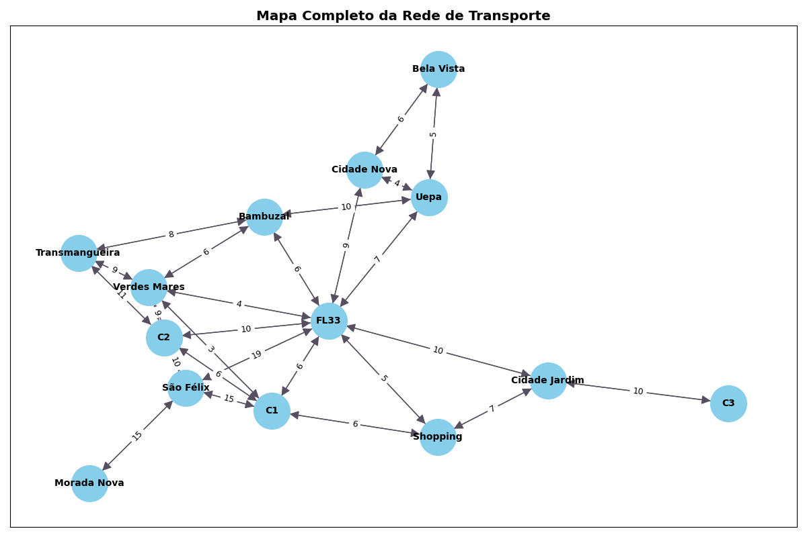

- [Objetivos](#objetivos)
- [Metodologia e desenvolvimento](#metodologia-e-desenvolvimento)
- [Estrutura do Repositório](#estrutura-do-repositório)
- [Comparação dos Algoritmos](#comparação-dos-algoritmos)
- [Conclusão](#conclusão)

# Objetivos 
O objetivo do projeto foi adotar novas tecnologias para melhorar a eficiência do sistema de transporte público de Marabá (PA). Um dos desafios principais foi otimizar as rotas dos ônibus para garantir que os cidadãos possam se deslocar de maneira eficiente entre diferentes pontos da cidade, aproveitando o máximo de suas rotas, minimizando o tempo de deslocamento e o custo operacional. Entre os objetivos específicos destacam-se:

 📌 Encontrar as rotas mais eficientes

 📌 Ponderar os pontos de interesse

 📌 Simular falhas na rede de tranporte público

 📌 Analisar o comportanmento do sistema diante das falhas

# Metodologia e desenvolvimento 

Foi utilizado os algoritmos Dijkstra e Bellman-Ford para determinar as rotas mais curtas entre os principais núcleos da cidade e o algoritmo de PageRank para ponderar os pontos de interesse dentro da rede de transporte, ou seja, definir os pontos mais importantes/mais críticos na rede.

A implementação de todas essas ferramentas permitiu a modelagem do sistema de transporte público como um grafo construído com base no mapa urbano da região de Marabá-PA. Ele considera pontos estratégicos que representam bairros e/ou polos importantes como Morada Nova, São Félix, os três campi da Unifesspa (C1, C2 e C3), as folhas 26 e 33, além de áreas centrais como a Transmangueira, Bambuzal, UEPA e a Avenida Bela Vista. Os pontos de ônibus são representados como vértices e as rotas possíveis entre eles como arestas, com pesos que representam o tempo estimado de trajeto.

### Bibliotecas utilizadas

`NetworkX`: foi a principal ferramenta usada para modelagem dos grafos.

No arquivo modelo_grafo.py, a função criar_grafo usa o *nx.DiGraph()* para criar o objeto de grafo e preenche-o com os dados do dicionário mapa. No arquivo plotagem.py, a biblioteca é usada para desenhar os nós (*nx.draw_networkx_nodes*), as arestas (*nx.draw_networkx_edges*) e os rótulos (*nx.draw_networkx_labels*). No arquivo algoritmos.py, a função pagerank usa o *nx.pagerank()* do NetworkX para calcular a importância de cada nó no grafo.

`Matplotlib`: usada para gerar a representação visual do grafo permitindo criar e personalizar gráficos, neste caso, o mapa da rede de transporte.

A biblioteca é importada no arquivo plotagem.py como plt e usa os comandos como *plt.figure()* para definir o tamanho da figura, *plt.title()* para adicionar um título e *plt.show()* para exibir o gráfico na tela por meio da função plotar_grafo.

`Heapq`: implementaç filas de prioridade e foi a base da implementação do algoritmo de Dijkstra no projeto, pois mantém uma lista de nós a serem visitados priorizando o nó com o menor custo total.

No arquivo algoritmos.py, *heapq.heappop(fila)* é usado na função dijkstra para pegar o nó com o menor custo e *heapq.heappush(fila, ...)* para adicionar novos nós à fila de prioridade.

### Estrutura do Repositório

`main.py` : ponto de entrada do programa. Responsável por exibir um menu para o usuário e coordenar a execução das diferentes funcionalidades (visualizar o mapa completo ou simular uma rota, por exemplo)

`modelo_grafo.py`: contém o dicionário mapa que define toda a estrutura do grafo, incluindo os nós e os pesos das arestas. Também conta com a função **criar_grafo** que transforma esse dicionário em um objeto de grafo do NetworkX.

`algoritmos.py`: armazena as implementações dos algoritmos Dijkstra, Bellman-Ford e PageRank.

`plotagem.py`: lida com a visualização do grafo desenhando o mapa da rede e destacar as rotas encontradas.

# Comparação dos Algoritmos
O algoritmo de Dijkstra funciona super bem em situações simples e é bastante usado em aplicativos como Google Maps e Waze, que priorizam velocidade e eficiência. Contudo, ele **não consegue lidar com valores negativos**. Já o Bellman-Ford é mais flexível aceitando pesos negativos e conseguindo detectar ciclos negativos, como casos de falhas no sistema tarifário. O ponto fraco do Bellman-Ford é que ele **é mais lento**, principalmente em redes grandes, podendo ser um problema em aplicações que precisam responder rápido.

Na prática, os dois forneceram resultados muito parecidos, tanto nas rotas encontradas quanto no tempo estimado dos trajetos. Além disso, ao aplicar restrições de percurso, observou-se que ambos os algoritmos foram capazes de recalcular os caminhos com eficiência, garantindo que o serviço continuasse operando mesmo diante de bloqueios. Em vista disso, tanto Dijkstra quanto Bellman-Ford se mostraram adequados para a otimização de rotas em sistemas de mobilidade. A escolha entre eles dependerá do contexto e das características específicas do problema a ser resolvido, sendo ambos ferramentas úteis.

- 🏆 Dijkstra teve desempenho rápido em situações com pesos sempre positivos;
- 🏆 Bellman-Ford demonstrou maior flexibilidade ao lidar com situações que envolvem penalidades, como engarrafamentos.

**No caso do trabalho proposto**, o algoritmo de Dijkstra se sobressaiu, uma vez que priorizamos velocidade. Além disso, os dados envolvidos são todos positivos e diretos, não implementamos ao sistema políticas públicas, integrações tarifárias ou análise de falhas, por isso o uso do Bellman-Ford (que é mais complexo e lento) foi dispensado.
